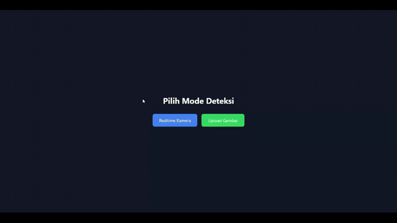

# Age, Gender & Facial Landmark Detection Web App

A web-based application built with **Flask**, **OpenCV**, and **MediaPipe** to detect **age**, **gender**, and **facial landmarks** from images or live camera feed.

## Features

- **Realtime Camera Detection**
  - Uses your webcam directly in the browser.
  - Performs live detection of **age**, **gender**, and **facial landmarks**.
  
- **Image Upload Detection**
  - Upload an image from your device.
  - The app processes the image and returns the detection result.

- **Modern UI**
  - Styled with [Tailwind CSS](https://tailwindcss.com/) via CDN.
  - Responsive and minimal interface.

## Preview


## Tech Stack

- **Backend**: Python, Flask
- **Computer Vision**: OpenCV, MediaPipe
- **ML Models**: Pre-trained Age & Gender detection models
- **Frontend**: HTML, Tailwind CSS

## Installation

### 1. Clone Repository
```bash
git clone https://github.com/yourusername/age-gender-landmark-flask.git
cd age-gender-landmark-flask

```

### 2. Create Virtual Environment
```bash
python -m venv venv
source venv/bin/activate   # Linux / Mac
venv\Scripts\activate      # Windows
```

### 3. Install Dependencies

```bash
pip install -r requirements.txt
```

### 4. Prepare Models

[Download](https://github.com/spmallick/learnopencv/tree/master/AgeGender) the pre-trained models and place them in the `model/` folder:

* `deploy.prototxt`
* `res10_300x300_ssd_iter_140000.caffemodel`
* `age_deploy.prototxt`
* `age_net.caffemodel`
* `gender_deploy.prototxt`
* `gender_net.caffemodel`


## Usage

### Run the Flask App

```bash
python app.py
```

Open your browser and go to:

```
http://127.0.0.1:5000/
```


## License

This project is licensed under the MIT License - see the [LICENSE](LICENSE) file for details.
